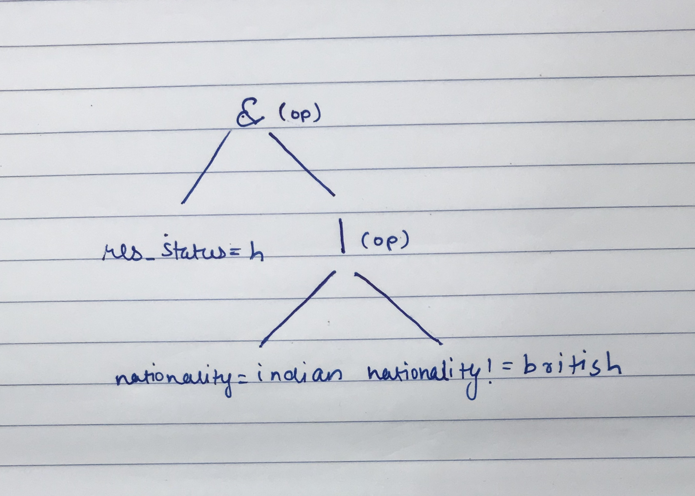

# StudentManage
## A Project for CSII

A student management system for the student body of HKU written in C++11, made for the course ENGG1340.

**S1. Abstract**

HKU has a large body of students, both current and previous. It is quite imperative to have a system to effectively and efficiently manage all undergraduate students so as have relevant and accurate student data at hand. This project aims to create such an information and management system using C++11. A basic student member would have data associated such as:

- UID [Primary key]
- Name
- Year
- Faculty
- Curriculum
- Status [Fulltime/ Exchange] --> if exchange, then Home Institution
- Nationality
- Residence status: University housing / Non-University housing

The queries will be divided into two in accordance to alumni body or current student body.

Upon running a query on a particular student, Further data is shown divided into:
- Academic
  - Show all courses past and current
  - Show courses pending for approval
  - Give GPA for previous semester and current CGPA
  - Show total credits accumulated
  - Attendance for courses which take attendance

- Financial
  - Show due payments - the amount, due date and overdue, **if any**
  - Show past payments

Basic **features** of the system include:
- Add new students (upon admission)
- Show all students
- Sort by criteria and filter out specific students according to a criteria [implement a simple query language and it's tokenizer and parser -----> see S4]
- Search for a specific student.
- Modify student record, including approval of courses, posting of grades, calculating new GPA etc.
- Approval of course system based on student's historical course data.
- Delete/transfer a student depending upon the situation: delete when drop-out and transfer when pass out from the current to alumni database.
- Have a merit and nationality based scholarship consideration system.

**S2. Alumni system**

The skeletal fields for the alumni system remains the same. However we introduce some new fields, which include:
- Final CGPA
- Year of Graduation
- Graduation Classification [1st division, 2nd division]
- Status will be removed
- Residence status will be removed

**S3. Programming overview**

  - C++ STL will be used for handling data structures like vectors, stacks and queues.
  - File handling will be used extensively for storing, modifying and adding data.
  - Searching algorithm implemented: Hash Map retrieval. O(1) time on average.
  - Sorting algorithm: Merge sort, due to the large number of records. Time complexity: O(nlogn).
  - The program will be divided into various header and C++ files for each of the functionalities.
  - Each student record would be a class.
  - Dynamic memory has been used to make a linked list which has been used to create a custom stack class.
  - C++ templates have been used in the implementation of the stack class.

**S4. The QLang**

A simple query language has been implemented for lexing and parsing of user inputted boolean commands (used only for the filtering feature as of now). A simple command goes like:

`>>> res_status=h & ( nationality=indian | nationality!=british )`

Note: the whitespaces do matter as of now for language tokenizing, as a string stream is being used.

The language mainly comprises of:

- Fields: The field on which to run the query, eg: `res_status`. These are special reserved words and have to be typed in exactly as specified. A list of field names is given at the end, along with their explanations.
- Value: The value to which the field is being compared to. eg: `h`. All values, even numbers are stored, parsed and processed as strings.
- Expressions: A Field-Value pair comparison using either `=` or `!=`, eg: `res_status=h`.
- Operators: For operating on two expressions in a boolean fashion. These include:
  - `&`: and Operator.
  - `|`: or Operator.
  Precedence is `( expression )` > `&` > `|`
- Commands: A recursive combination of operators and expressions.

A parsing tree is shown below:

**Interface**

This will be mostly text based due to the absence of a feasible graphics library. However, every measure will be taken to make it as user friendly as possible.

## We hope you enjoy using the system as much as we enjoyed creating it.
# Thank you!
